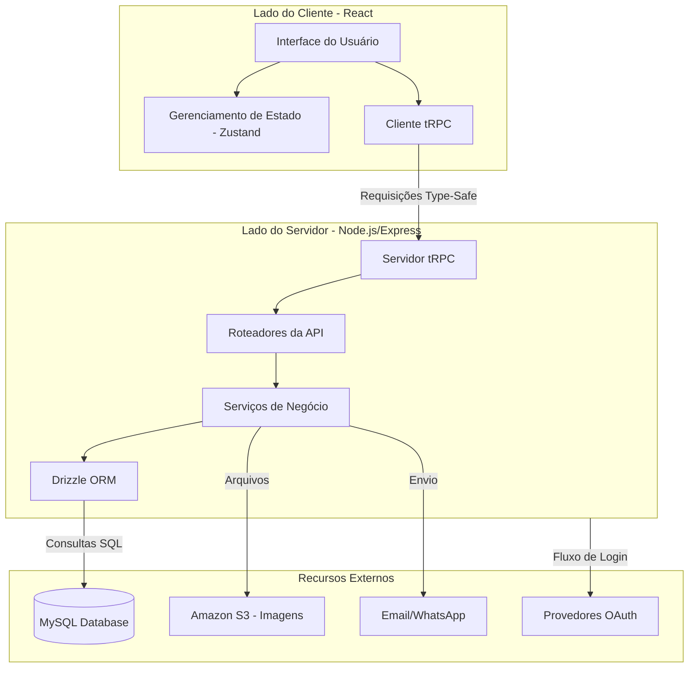
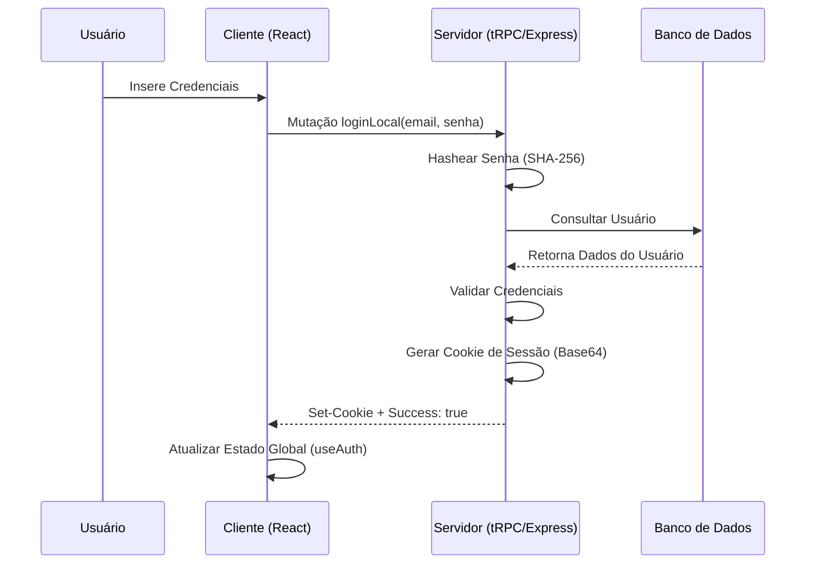
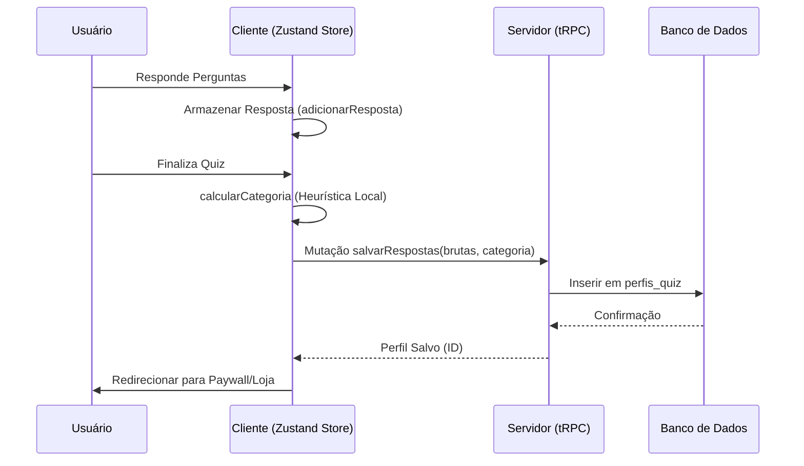
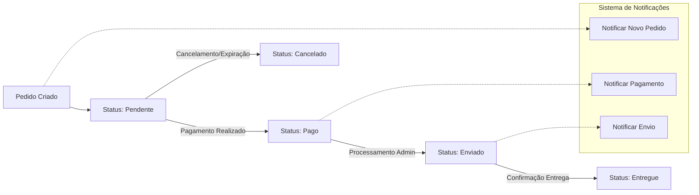

# Arquitetura do Projeto: Box & Health

Este documento apresenta a arquitetura de ponta a ponta do projeto Box & Health, utilizando diagramas Mermaid para facilitar a compreensão dos fluxos de dados e da organização do sistema.

## 1. Visão Geral do Sistema

O sistema é uma aplicação web full-stack para descoberta e compra de caixas de bem-estar personalizadas.

## 2. Fluxo de Autenticação

O sistema suporta login local e autenticação externa.

## 3. Fluxo do Quiz e Recomendação

O núcleo da personalização da plataforma.

## 4. Ciclo de Vida do Pedido

Rastreamento de transações e notificações.

Este diagrama representa a arquitetura de ponta a ponta do projeto Box & Health, integrando as camadas de frontend, backend e serviços externos.
