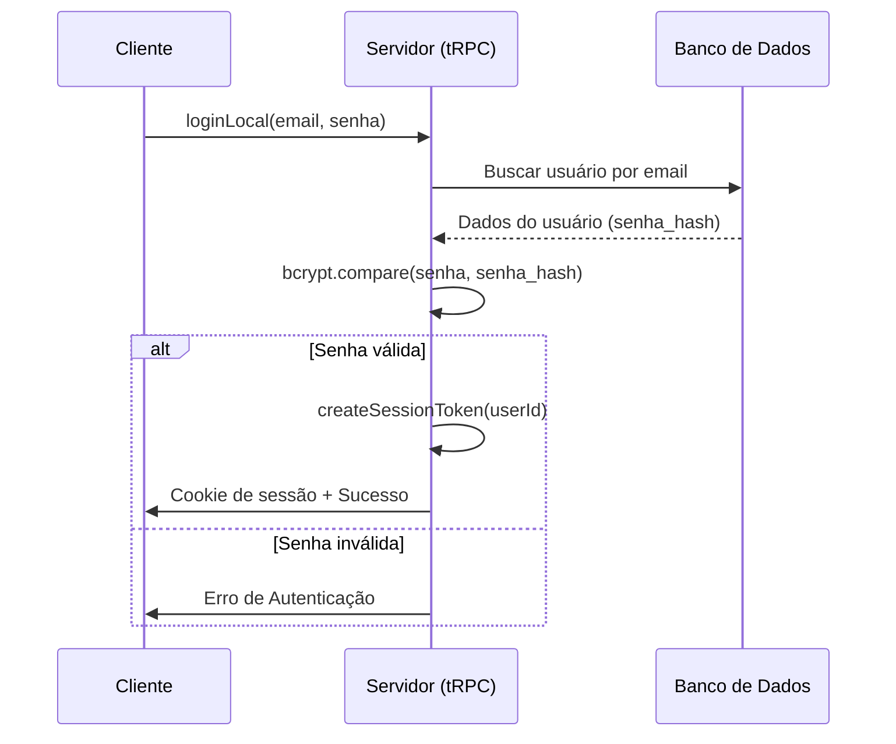

# Plano de Melhoria da Autenticação

## Contexto Atual
O projeto utiliza um sistema de autenticação local (login com email/senha) implementado via `tRPC` no `server/routers/auth.ts` e `server/services/authService.ts`. As senhas estão sendo armazenadas usando um hash simples SHA-256 (conforme identificado em `server/services/authService.ts`).

## Objetivos
1. Substituir o hash SHA-256 por um algoritmo seguro como `bcryptjs` ou `argon2`.
2. Reforçar a segurança das sessões.
3. Manter a compatibilidade com a implementação atual.

## Etapas de Implementação

### 1. Preparação
- [ ] Instalar `bcryptjs` e seus tipos `@types/bcryptjs`.
- [ ] Criar um script de migração/script temporário para atualizar os hashes das senhas (opcional, mas recomendado se quiser suporte a migração de senhas existentes).

### 2. Refatoração do `authService.ts`
- [ ] Alterar `hashSenha` para usar `bcryptjs`.
- [ ] Implementar a verificação de senha usando `bcryptjs.compare`.

### 3. Testes
- [ ] Validar o fluxo de registro e login com o novo método de hashing.

---

## Diagrama de Sequência de Login (Proposto)

