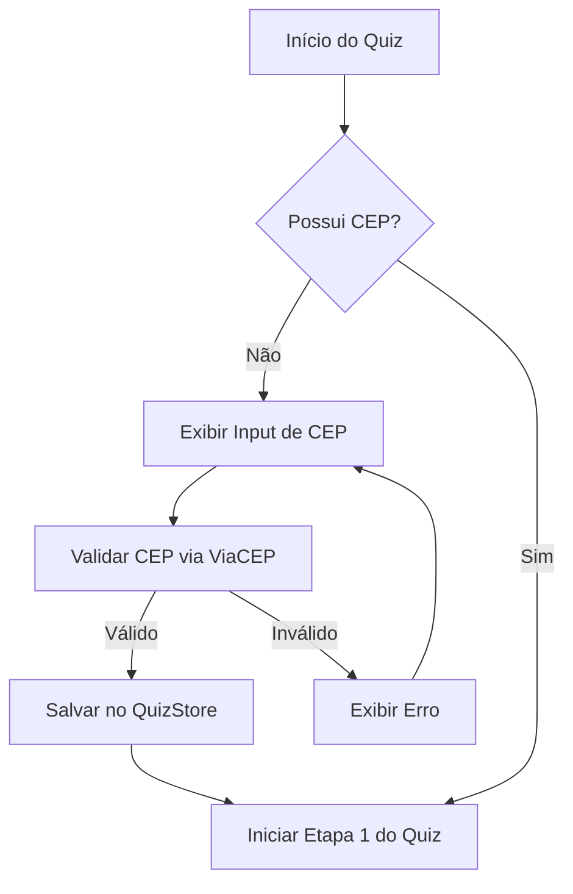

# Fluxo de Coleta de CEP no Quiz

O novo fluxo introduz uma etapa de validação de CEP antes do início das perguntas, garantindo que o usuário esteja em uma área atendida (ou apenas coletando o dado de localização) antes de prosseguir.

## Mudanças Planejadas

### 1. `client/src/stores/quizStore.ts`
* Adicionar novos campos ao estado: `cep`, `endereco` (objeto com logradouro, bairro, cidade, uf).
* Adicionar função `setEndereco(endereco: Endereco)`.

### 2. `client/src/pages/Quiz.tsx`
* Criar um estado `showCepInput` (ou transformar em uma etapa inicial).
* Integrar `fetch` com API `viacep.com.br/ws/{cep}/json/` para validar o CEP.
* Atualizar a lógica de renderização para exibir o input de CEP primeiro.
