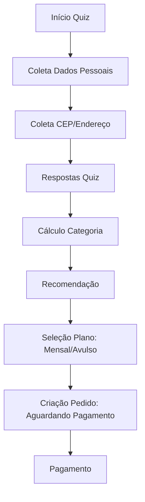

# Plano de Implementação - Melhorias no Box-Health

## 1. Fluxo de Pagamento: Processamento Inicial
- **Backend:** Adicionar status `aguardando_pagamento` no `orderService` e nas rotas de criação de pedido.
- **Frontend:** Atualizar `PagamentoPix` para exibir mensagem de "Processando" enquanto aguarda a confirmação via webhook/polling.

## 2. Fluxo de Coleta de Dados: Reorganização
- **Frontend (`Quiz.tsx`):** Mover o componente `CepInput` para após a coleta dos dados pessoais (Nome, Email, WhatsApp, Senha).
- **Lógica:** Manter o estado de endereço no `quizStore` e garantir persistência durante o fluxo de cadastro.

## 3. Opções de Compra: Assinatura vs. Avulso
- **Frontend:** Atualizar páginas de pagamento e checkout para incluir seletor (RadioGroup) entre "Mensalidade" e "Compra Avulsa".
- **Backend:** Ajustar o `criarPedido` para aceitar a nova seleção e persistir no banco de dados.

## 4. Aba "Meus Pedidos": Visibilidade
- **Frontend (`Perfil.tsx`):** Adicionar verificação condicional na renderização do botão/aba de pedidos baseada no array de pedidos retornado pela query.

---

### Fluxo de Trabalho (Mermaid)

